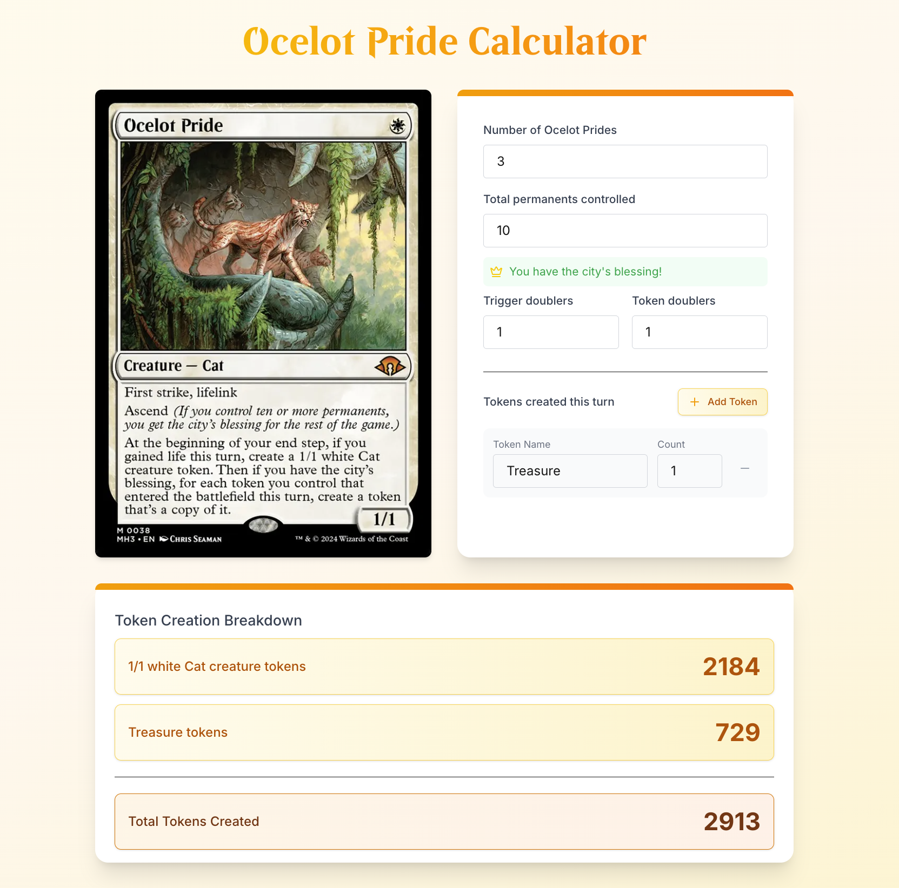

# Ocelot Pride Calculator



Have you ever been in a situation where you need to calculate the number of tokens you will create with Ocelot Pride but it's taking too long to do the math? Maybe you find yourself in the unfortunate situation of having created multiple token copies of Ocelot Pride. Maybe you're wondering whether to play Roaming Throne or Mondrak to generate the most cats to throw at your opponents with Goblin Bombardment. Or maybe you need to know how much life you're about to gain from your Soul Warden. Regardless, this tool is for you.

[Live Demo](https://ocelot-pride-calc.vercel.app/)

## Features

- Calculate token creation based on:
  - Number of Ocelot Prides in play
  - Total permanents controlled
  - Trigger doublers
  - Token doublers
  - Custom token types
- Real-time calculation updates
- Beautiful, responsive UI with animations
- Support for multiple token types
- Visual indication of "city's blessing" (10+ permanents)

## Getting Started

### Prerequisites

- Node.js (v18 or later)
- npm, yarn, or pnpm

### Installation

1. Clone the repository:

```bash
git clone https://github.com/yourusername/ocelot-pride-calc.git
cd ocelot-pride-calc
```

2. Install dependencies:

```bash
npm install
# or
yarn install
# or
pnpm install
```

3. Run the development server:

```bash
npm run dev
# or
yarn dev
# or
pnpm dev
```

4. Open [http://localhost:3000](http://localhost:3000) with your browser to see the application.

## Usage

1. Enter the number of Ocelot Prides you control
2. Input your total number of permanents
3. Add any trigger doublers or token doublers
4. Add custom token types if needed
5. View the calculated results in real-time

## Live Demo

Try out the calculator at [https://ocelot-pride-calc.vercel.app/](https://ocelot-pride-calc.vercel.app/)

## Technologies Used

- [Next.js](https://nextjs.org/) - React framework
- [React](https://reactjs.org/) - UI library
- [TypeScript](https://www.typescriptlang.org/) - Type safety
- [Tailwind CSS](https://tailwindcss.com/) - Styling
- [Framer Motion](https://www.framer.com/motion/) - Animations
- [Lucide React](https://lucide.dev/) - Icons

## Contributing

Contributions are welcome! Please feel free to submit a Pull Request.

## License

This project is licensed under the MIT License - see the [LICENSE](LICENSE) file for details.

## Acknowledgments

- Magic: The Gathering and Ocelot Pride are properties of Wizards of the Coast
- This is a fan-made tool and is not affiliated with Wizards of the Coast
